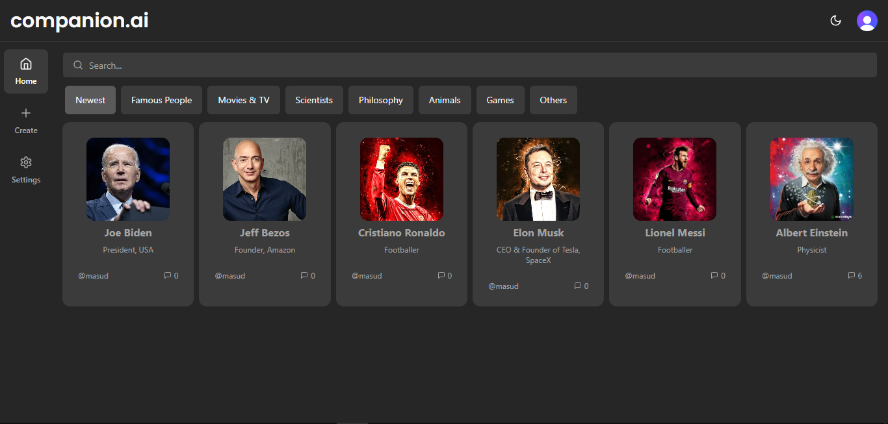

<h1 align="center">
AI Companion App with Next.js 13, React, Tailwind, Prisma, Stripe, MongoDB</h1>

<p align="center"></p>

<p>This is a repository to create and host AI companions that you can chat via SMS. This application build with Next.js 13, React, Tailwind, Prisma, Stripe, mongodb, Upstash, Langchain, ShandcnUI and many more technologies.</p>

## 📝 Features

- Create, Update & Delete companion functionality
- Real time conversation with AI companion
- Real time message generate using Replicate, Upstash, Langchain & OpenAI,
- Authentication with Clerk
- Image upload with Cloudinary
- Free and Paid services
- Stripe monthly subscription
- Search functionality
- Light/Dark mode
- Full responsivity and mobile UI
- ORM using Prisma


## 🛠️ Installation Steps:

<p>1. Clone the repository</p>

```
git clone https://github.com/masud-rana44/ai-companion.git
```

<p>2. Install dependencies </p>

```
npm i
```

<p>3. Setup .env file </p>

```
NEXT_PUBLIC_CLERK_PUBLISHABLE_KEY=
CLERK_SECRET_KEY=

NEXT_PUBLIC_CLERK_SIGN_IN_URL=/sign-in
NEXT_PUBLIC_CLERK_SIGN_UP_URL=/sign-up
NEXT_PUBLIC_CLERK_AFTER_SIGN_IN_URL=/
NEXT_PUBLIC_CLERK_AFTER_SIGN_UP_URL=/

OPENAI_API_KEY=
REPLICATE_API_TOKEN=

PINECONE_API_KEY=
PINECONE_ENVIRONMENT=
PINECONE_INDEX=

UPSTASH_REDIS_REST_URL=
UPSTASH_REDIS_REST_TOKEN=

NEXT_PUBLIC_CLOUDINARY_CLOUD_NAME=

DATABASE_URL=

STRIPE_API_KEY=
STRIPE_WEBHOOK_SECRET=

NEXT_PUBLIC_APP_URL=
```

<p>4. Setup Prisma </p>

```
npx prisma db push
```

<p>5. Seed Category </p>

```
node scripts/seed.ts
```

<p>6. Start the app</p>

```
npm run dev
```

## 💻 Technology Used

The AI Companion Application is built using the following technologies and libraries:

Dependencies:

- @clerk/nextjs: ^4.23.5
- @hookform/resolvers: ^3.3.1
- @pinecone-database/pinecone: ^1.0.0
- @prisma/client: ^5.3.1
- @radix-ui/react-avatar: ^1.0.3
- @radix-ui/react-dialog: ^1.0.4
- @radix-ui/react-dropdown-menu: ^2.0.5
- @radix-ui/react-label: ^2.0.2
- @radix-ui/react-select: ^1.2.2
- @radix-ui/react-separator: ^1.0.3
- @radix-ui/react-slot: ^1.0.2
- @radix-ui/react-toast: ^1.1.4
- @types/node: 20.6.0
- @types/react: 18.2.21
- @types/react-dom: 18.2.7
- @upstash/ratelimit: ^0.4.4
- @upstash/redis: ^1.22.0
- ai: ^2.2.12
- autoprefixer: 10.4.15
- axios: ^1.5.0
- class-variance-authority: ^0.7.0
- clsx: ^2.0.0
- dotenv: ^16.3.1
- eslint: 8.49.0
- eslint-config-next: 13.4.19
- langchain: ^0.0.147
- lucide-react: ^0.274.0
- next: 13.4.19
- next-cloudinary: ^4.21.0
- next-themes: ^0.2.1
- openai: ^4.6.0
- openai-edge: ^1.2.2
- postcss: 8.4.29
- query-string: ^8.1.0
- react: 18.2.0
- react-dom: 18.2.0
- react-hook-form: ^7.46.1
- react-spinners: ^0.13.8
- replicate: ^0.12.3
- stripe: ^13.5.0
- tailwind-merge: ^1.14.0
- tailwindcss: 3.3.3
- tailwindcss-animate: ^1.0.7
- typescript: 5.2.2
- zod: ^3.22.2
- zustand: ^4.4.1

- Dev Dependencies:
- prettier: ^3.0.3
- prettier-plugin-tailwindcss: ^0.5.4
- prisma: ^5.3.1

<h3>💖Like my work?</h3>

This project needs a ⭐️ from you. Don't forget to leave a star ⭐️.
